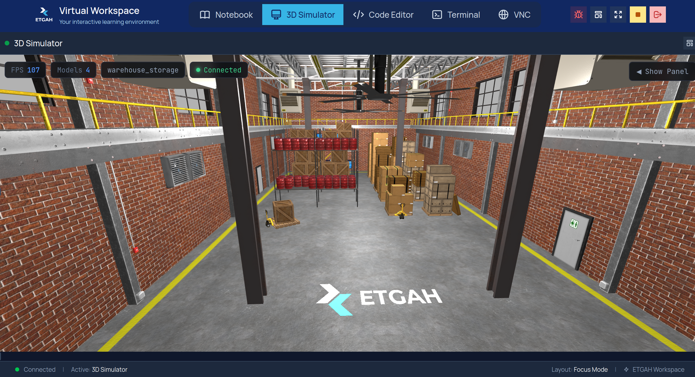

# ETGAH Warehouse World

This ROS 2 package provides the warehouse simulation environment for the **Autonomous Warehouse Delivery Robot Final Project**.

It contains the warehouse world, models, configuration files, and a basic launch file for testing the environment.



## Package Structure

```text
warehouse_world/
├── config/
├── launch/
│   └── warehouse_storage_launch.launch.py
├── models/
├── worlds/
├── CMakeLists.txt
├── package.xml
└── README.md
```
---

## Build the Package

```bash
cd ~/workspaces/turtlebot_ws
colcon build --packages-select warehouse_world
source install/setup.bash
```
---

## Test the Warehouse World from the UI

Open the **Worlds** panel, then select:

```bash
warehouse_storage_launch.launch
```

The provided launch file launches **only the warehouse world** for testing.

Click **Launch** to start the warehouse world in the 3D Simulator.

---


As part of the final project, students must update the launch file to:

* Launch the warehouse world.
* Spawn TurtleBot3 Burger inside the warehouse.
* Set the robot’s correct starting position.
* Confirm that `/scan`, `/odom`, and the required TF frames are available.

The completed environment will then be used for SLAM Toolbox, AMCL, Nav2, and the autonomous waypoint mission.

---
